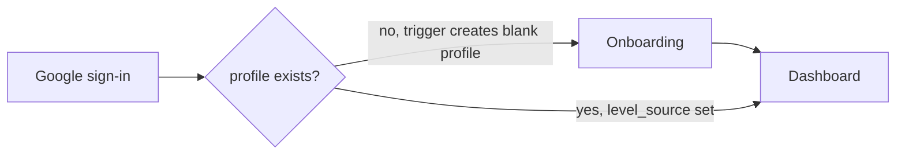
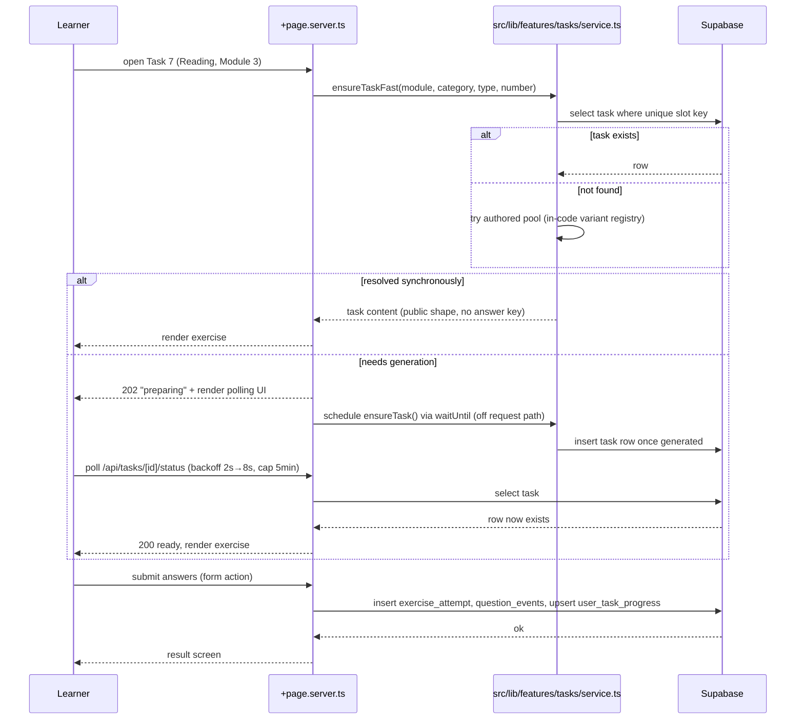

# Application Flow

## First-time user



`hooks.server.ts` resolves the Supabase session on every request and attaches
`locals.user`. The `(app)/+layout.server.ts` guard checks for a session and
redirects to `/login` if absent; it does **not** check onboarding status —
that's the `(app)/+layout.svelte`'s job via a lightweight `profile.level_source`
check, redirecting to `/onboarding` only when unset. Keeping these as two
separate, narrow checks (session vs. onboarding) avoids one layout guard
trying to encode every rule about who can see what.

## Returning user

```
Sign in → Dashboard (always the landing page post-auth)
  ↓ learner picks one of:
  Lessons        → work through next unfinished lesson
  Class          → pick category → pick/continue a task number
  Mock Tests     → pick module → sit full or partial test
  Progress       → review mistakes / history / unlock status
  Settings       → profile / level override
  ↓ (any graded activity)
  writes to exercise_attempts + question_events (+ mistake_records)
  ↓
  Dashboard reflects it on next visit (no cache to invalidate —
  dashboard metrics are computed fresh from the tables above each load)
```

## Class practice session (detailed)



## Mock test session

Same task-resolution machinery as Class (numbered mode), assembled for every
part of the test in parallel, wrapped in an `exam_sessions` row. See
[docs/features/mock-tests.md](../features/mock-tests.md) for the full flow,
including the rotating (non-numbered) assembly mode.

## Report card reconciliation

```
Upload (Storage) → OCR extraction → learner confirms/corrects
  → official_test_results rows created
  → module_skill_status.official_passed set (official always wins here)
  → if it disagrees with in_app_passed: discrepancy = true, noted, not auto-resolved
```
