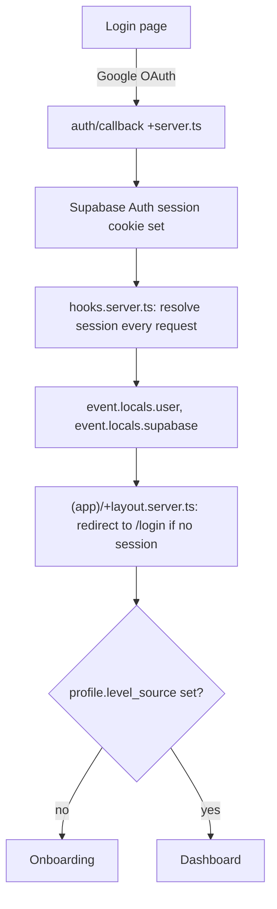

# Authentication Flow

Full feature detail in [docs/features/authentication.md](../features/authentication.md).
This doc is the architecture-level summary other docs link to.

## Stack

Supabase Auth only. Google OAuth in production. Invite-only — there is no
self-serve sign-up route; accounts are provisioned out-of-band (a script,
not a UI), matching the current app's model.

## Flow

## Where identity resolution lives

`hooks.server.ts` calls `supabase.auth.getUser()` (revalidates against
Supabase on every request — never trusts a client-editable cookie value
directly) and populates `event.locals`. No route or component calls
Supabase Auth directly to ask "who is this" — they all read `locals.user`.

Because `profiles.id` **is** `auth.users.id` (no separate app-generated id
to reconcile, unlike the old Prisma `User.id` cuid that had to be linked to
a Supabase UUID), there is no identity-linking logic to port. This is a
genuine simplification enabled by dropping the NextAuth-shaped tables — see
[ADR-002](../decisions/ADR-002-database.md).

## Dev-only test login

Same two-independent-checks pattern as the current Next.js app, ported
deliberately:

1. The route handler itself checks `NODE_ENV !== 'production'` (or the
   SvelteKit/Vercel equivalent) and 404s otherwise.
2. The layout/hook that would expose the test-login control also checks the
   same condition independently, so the path is unreachable pre-auth in
   production even if the route's own check is ever changed without
   updating the other.

## Error handling

Supabase Auth errors are mapped to a closed set of app-level error codes
before reaching the UI (never render a raw `?error=` message — it's a
social-engineering surface, not an XSS one, but still worth closing). See
`docs/features/authentication.md` for the exact code list.

## What changes from the old app

- No more `User`/`Account`/`Session`/`VerificationToken` tables or any
  identity-linking function — `auth.users` is the only identity table.
- Next.js middleware (`proxy.ts`) becomes `hooks.server.ts`.
- `cookies().get(...)` / Next's cookie API becomes SvelteKit's
  `event.cookies`, wired into `@supabase/ssr`'s SvelteKit helpers.
