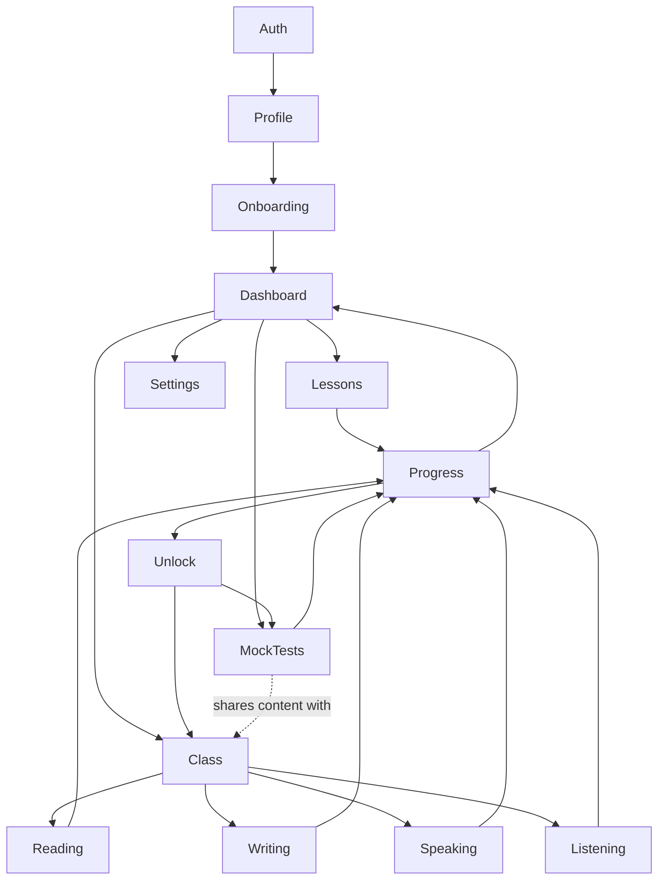

# Feature Dependencies

## Required dependencies

- **Auth → Profile → Onboarding → Dashboard**: hard sequence, nothing after
  Auth can render without a resolved session; nothing after Onboarding
  should render without `level_source` set (the layout guard enforces this).
- **Class/Lessons/MockTests → Progress**: every graded activity must write
  through the shared attempt-recording path (`docs/database/relationships.md`)
  — a feature that grades something without going through it is a bug, not
  a variant.
- **Progress → Dashboard**: the dashboard has no feature-specific dependency
  on Lessons/Class/MockTests directly — it only ever reads Progress-derived
  data. This keeps the dashboard from needing to know about a new category
  (e.g. future Listening content) beyond what Progress already aggregates.
- **Progress → Unlock → Class/MockTests**: a learner's next-module access is
  gated by unlock status, which is itself gated by Progress. Unlock never
  reads Class/MockTests tables directly — only the aggregated
  `module_skill_status` (fed by exam sessions + official results).

## Optional dependencies

- **Settings → Profile**: settings can change profile fields, but no other
  feature depends on Settings existing — it's a leaf.
- **Class → Reading/Writing/Speaking/Listening**: these are siblings under
  Class, not dependent on each other. Adding Listening content later
  requires no change to Reading/Writing/Speaking.

## Shared infrastructure (not a feature dependency, a cross-cutting one)

- **AI boundary** (`src/lib/ai/`): used by Reading (explanations), Writing/
  Speaking (feedback), and content generation for any category whose
  authored pool is exhausted. No feature depends on another feature's use
  of AI — each calls the shared registry independently.
- **Auth session** (`event.locals`): every feature depends on this, but it's
  infrastructure, not a feature node — it doesn't appear in the graph above
  for that reason.

## No circular dependencies

There are none in this graph, and the rule going forward is: Progress is a
sink for every feature that grades something, and a source only for
Dashboard and Unlock. Any PR that makes Progress depend on Dashboard,
Unlock, or a specific category feature (reaching into `reading_progress`
from a generic progress function, for example, instead of staying at the
`question_events`/`mistake_records` level) breaks this invariant and should
be rejected in review.
