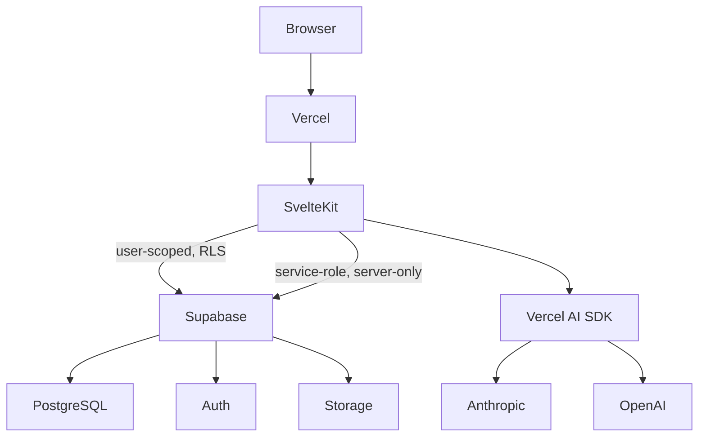

# Architecture Overview

## Stack

| Layer | Technology |
|---|---|
| Framework | SvelteKit (Svelte 5 runes), TypeScript strict |
| Database | Supabase Postgres |
| Auth | Supabase Auth, Google OAuth, invite-only |
| Storage | Supabase Storage (report-card uploads) |
| AI | Vercel AI SDK, Anthropic + OpenAI behind one registry |
| Hosting | Vercel, serverless functions |

## The one-sentence architecture

A SvelteKit route's `load`/action talks directly to Supabase (via a per-request
client attached to `event.locals`) to read or write exactly the data that
route needs; AI is called from inside that same server code only for the
handful of operations that genuinely need language understanding, and only
after application logic has already decided everything deterministic.

## Request shape (the default case)

```
Browser
  │  navigate / submit form
  ▼
+page.server.ts  (load or action)
  │  uses event.locals.supabase (RLS-scoped) or event.locals.supabaseAdmin
  ▼
Supabase Postgres
  │
  ▼
typed result
  │
  ▼
Svelte component (render)
```

No client-side `fetch` to an internal API for this path. See
[data-flow.md](data-flow.md) for the full lifecycle including the AI
variant and the async-generation variant.

## Where `+server.ts` endpoints are legitimate

Three cases only — everything else is a load function or form action:

1. **Status polling** — a client poller checks whether a slow, deferred AI
   generation has finished (`GET /api/tasks/[id]/status`). A page load can't
   serve this because the answer changes between requests on a timer the
   client controls, not on navigation.
2. **Streaming** — if a feature streams an AI response token-by-token to the
   client, it needs a `+server.ts` that returns a stream.
3. **Webhooks** — inbound calls from a third party (none currently planned,
   documented here so a future one has an obvious home).

## Why not a separate API layer

The old Next.js app already proved this works: two React Context providers
total, everything else server-loaded or local component state, no REST API
between the SvelteKit app and itself. SvelteKit's load functions and actions
are the API — adding a `fetch('/api/...')` hop from a component to your own
server, when the server could have supplied the data via `load`, is strictly
worse: one more network round trip, one more place to keep types in sync,
one more thing that can silently diverge from RLS assumptions.

## Deployment



### Environment variables and secret boundaries

| Variable | Where used | Exposure |
|---|---|---|
| `PUBLIC_SUPABASE_URL` | client + server | public (by Supabase design) |
| `PUBLIC_SUPABASE_ANON_KEY` | client + server | public (RLS-protected) |
| `SUPABASE_SERVICE_ROLE_KEY` | server only | **secret** — never in any `$env/dynamic/public` or `PUBLIC_*` var |
| `ANTHROPIC_API_KEY` | server only (`src/lib/ai/`) | secret |
| `OPENAI_API_KEY` | server only (`src/lib/ai/`) | secret |
| `AI_PROVIDER` | server only | not secret, but still server-side config |

Any variable without a `PUBLIC_` prefix in SvelteKit is server-only by
default — this is enforced by the framework, not a convention to remember,
which is one real advantage over the old Next.js setup where `NEXT_PUBLIC_`
vs. unprefixed is the same idea but easier to get wrong by habit.

## Related docs

- [project-graph.md](project-graph.md) — full feature/data/AI graphs
- [data-flow.md](data-flow.md) — request lifecycles in detail
- [auth-flow.md](auth-flow.md)
- [ai-architecture.md](ai-architecture.md)
- [database-architecture.md](database-architecture.md)
- [scaling.md](scaling.md)
