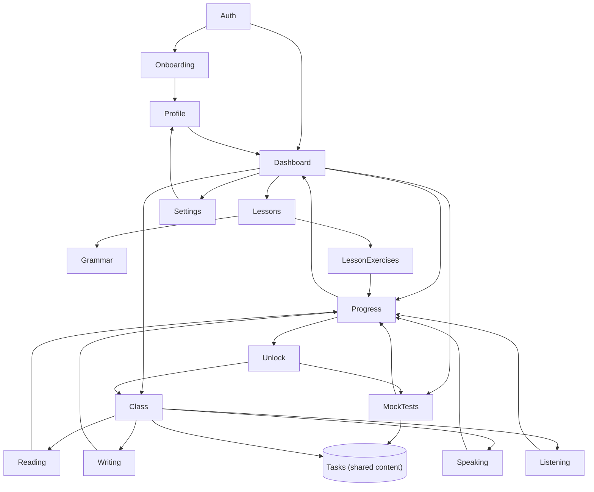

# Project Graph

## Feature graph



Key reading: **Class and MockTests both point at the same `Tasks` node** —
they are not parallel content systems. `Progress` is the single sink every
graded activity feeds, and the only thing `Dashboard` reads from for
activity metrics — the dashboard never queries Lessons/Class/MockTests
directly.

## Frontend graph (request shape)

```
Route (+page.svelte)
 ↓
+page.server.ts  (load / action)
 ↓
Feature logic  (src/lib/features/<domain>/)
 ↓
Supabase (event.locals.supabase, RLS-scoped)
```

Every arrow is a direct call, not a network hop, until the final one.

## AI graph

```
UI (form submit: "explain this sentence" / "generate feedback")
 ↓
+page.server.ts action  (validates input, checks rate/availability)
 ↓
src/lib/ai/<operation>.ts  (small, single-purpose function)
 ↓
src/lib/ai/registry.ts  (resolves provider + model + effort)
 ↓
Vercel AI SDK  (generateObject with a Zod schema)
 ↓
LLM (Anthropic or OpenAI)
 ↓
Zod-validated response  (or a typed failure outcome — never a throw)
 ↓
UI  (rendered result, or a fallback state on failure)
```

See [ai-architecture.md](ai-architecture.md) for the async-generation
variant of this graph (task content generation, which is slow enough to be
deferred off the request path).

## Database graph

```
auth.users
 ↓
profiles
 ↓
tasks (shared) ──┬── exercise_attempts ──┬── question_events ──> mistake_records
                  │                       └── user_task_progress
                  └── exam_sessions
                                          lesson_progress
                                          reading_progress / saved_words / notes / highlights
                                          verb_progress
 ↓ (aggregated by)
module_skill_status ←── official_test_results ←── report_cards
```

Full table-level detail in [docs/database/schema.md](../database/schema.md)
and [relationships.md](../database/relationships.md).

## Deployment graph

See [overview.md](overview.md#deployment).
