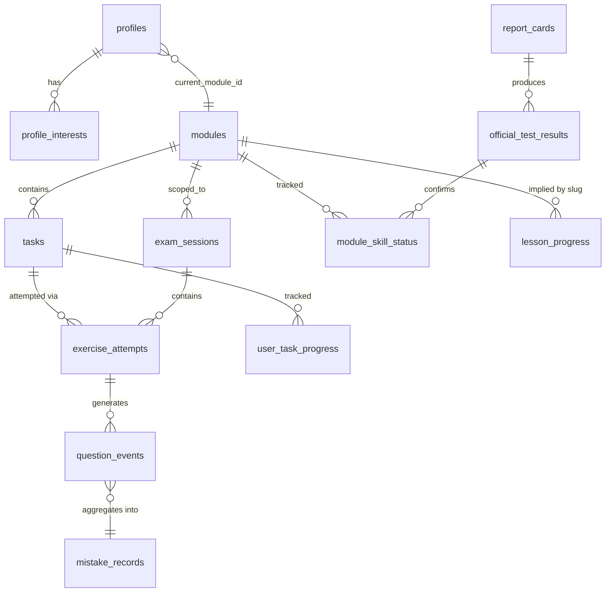

# Database Schema

Target: Supabase Postgres. This is the schema for the SvelteKit rewrite —
it is not a 1:1 port of the old Prisma schema. See
[docs/decisions/ADR-002-database.md](../decisions/ADR-002-database.md) for
why it diverges, and [architecture-review.md](../architecture/architecture-review.md)
for what was deliberately left out.

Identity is `auth.users` (Supabase Auth). There is no app-owned `users` table —
the old `User`/`Account`/`Session`/`VerificationToken` NextAuth-shaped tables
are gone entirely; every user-owned table references `auth.users(id)` directly,
and `profiles` is the 1:1 extension row.

## Enums

```sql
create type education_level as enum ('DU2', 'DU3');
create type level_source as enum ('ONBOARDING', 'OFFICIAL_RESULT');
create type category as enum ('READING', 'WRITING', 'SPEAKING', 'LISTENING');
create type task_source as enum ('AUTHORED', 'GENERATED');
create type exam_type as enum ('MODULTEST', 'PD3');
create type exam_status as enum ('IN_PROGRESS', 'COMPLETED', 'ABANDONED');
create type lesson_status as enum ('IN_PROGRESS', 'COMPLETED');
create type word_kind as enum ('WORD', 'PHRASE');
create type result_source as enum ('SELF_REPORTED', 'REPORT_CARD');
create type report_card_status as enum ('UPLOADED', 'EXTRACTED', 'CONFIRMED');
```

These are real Postgres enums, not validated strings. The old schema used
strings specifically to avoid migration churn on an existing, live database —
that constraint doesn't exist for a fresh schema, so we use enums. See ADR-002.

## Reference data

### `modules`
Static reference data (5 rows), seeded once via migration, not user-editable.

| column | type | notes |
|---|---|---|
| `id` | smallint PK | 1–5 |
| `slug` | text unique | e.g. `modul-3` |
| `cefr_goal` | text | |
| `is_final_exam` | boolean | true for the PD3-equivalent module |
| `is_oral_only` | boolean | |
| `sort_order` | smallint | |

Lesson/reading/verb **content** (chapters, passages, verb lists) is
code-shipped, not a table — same decision the old schema made and a good one.
Only the user's relationship to that content is persisted, keyed by a stable
string id (slug).

## Profile

### `profiles`
1:1 with `auth.users`.

| column | type | notes |
|---|---|---|
| `id` | uuid PK, references `auth.users(id)` on delete cascade | |
| `email` | text | mirrored for display only; `auth.users` is the source of truth |
| `name` | text nullable | |
| `education` | `education_level` not null default `'DU3'` | |
| `current_module_id` | smallint references `modules(id)` | |
| `level_source` | `level_source` not null default `'ONBOARDING'` | |
| `created_at` / `updated_at` | timestamptz | |

### `profile_interests`
Normalized out of the old `interestsJson` blob — a learner can have several
interests, used only to bias reading recommendations.

| column | type |
|---|---|
| `profile_id` | uuid references `profiles(id)` on delete cascade |
| `interest` | text |

PK `(profile_id, interest)`.

## Task / exercise engine

### `tasks`
The numbered slot. A slot is empty until first opened, then permanent —
"Task 14" means the same content every time it's reopened. This is the core
design kept from the old app (see `docs/features/class.md`).

| column | type | notes |
|---|---|---|
| `id` | uuid PK default `gen_random_uuid()` | |
| `module_id` | smallint references `modules(id)` | |
| `category` | `category` not null | |
| `task_type` | text not null | validated against a closed per-category list in application code (see `docs/features/class.md`) — not an enum because the set grows with content, not with schema |
| `task_number` | smallint not null | 1..N per ladder |
| `variant_id` | text not null | id of the authored/generated variant actually used |
| `content` | jsonb not null | full content **including the answer key** — stripped before it ever reaches the client, never queried from the client role |
| `source` | `task_source` not null | |
| `difficulty` | smallint not null | |
| `created_at` | timestamptz | |

Unique `(module_id, category, task_type, task_number)`.

### `exercise_attempts`
One sitting of one task (not one question). Always inserted, never updated —
"practicing Task 14 again adds a row."

| column | type | notes |
|---|---|---|
| `id` | uuid PK | |
| `user_id` | uuid references `auth.users(id)` | |
| `task_id` | uuid references `tasks(id)` nullable | null for an ephemeral, never-persisted mock-test part (rotating assembly mode — see `docs/features/mock-tests.md`) |
| `exam_session_id` | uuid references `exam_sessions(id)` nullable | presence of this column is what marks an attempt as part of a mock — there is no separate "mode" flag |
| `order_index` | smallint nullable | position within the exam session |
| `module_id` | smallint references `modules(id)` | |
| `category` | `category` not null | |
| `task_type` | text not null | |
| `variant_id` | text not null | |
| `generated` | boolean not null default false | |
| `variant_json` | jsonb not null | server-only answer key snapshot at attempt time |
| `score` | numeric nullable | null for ungraded (writing, pending AI feedback) |
| `total` | numeric nullable | |
| `explanation_json` | jsonb nullable | |
| `feedback_json` | jsonb nullable | |
| `speaking_state_json` | jsonb nullable | |
| `created_at` | timestamptz | |

### `user_task_progress`
Per-learner summary per task. `best_score` and `last_score` are both kept —
they answer different questions and are never merged into one number.

| column | type |
|---|---|
| `user_id` | uuid references `auth.users(id)` |
| `task_id` | uuid references `tasks(id)` |
| `best_score` | numeric |
| `last_score` | numeric |
| `attempt_count` | integer not null default 0 |
| `updated_at` | timestamptz |

PK `(user_id, task_id)`.

### `exam_sessions`
One mock-test sitting.

| column | type |
|---|---|
| `id` | uuid PK |
| `user_id` | uuid references `auth.users(id)` |
| `module_id` | smallint references `modules(id)` |
| `exam_type` | `exam_type` not null |
| `status` | `exam_status` not null default `'IN_PROGRESS'` |
| `scores` | jsonb |
| `passed` | jsonb |
| `started_at` / `completed_at` | timestamptz |

## Unlock state

### `module_skill_status`
Two signals per `(user, module, skill)`, deliberately never merged — see
`docs/features/progress.md` and `docs/architecture/architecture-review.md`
for why this is intentional, not an oversight.

| column | type |
|---|---|
| `user_id` | uuid references `auth.users(id)` |
| `module_id` | smallint references `modules(id)` |
| `skill` | `category` not null |
| `in_app_passed` | boolean not null default false |
| `in_app_score` | numeric |
| `official_passed` | boolean not null default false |
| `official_source_id` | uuid references `official_test_results(id)` nullable |
| `discrepancy` | boolean not null default false |
| `discrepancy_note` | text |

PK `(user_id, module_id, skill)`.

### `official_test_results`

| column | type |
|---|---|
| `id` | uuid PK |
| `user_id` | uuid references `auth.users(id)` |
| `module_id` | smallint references `modules(id)` |
| `skill` | `category` |
| `passed` | boolean |
| `score` | numeric |
| `source` | `result_source` not null |
| `report_card_id` | uuid references `report_cards(id)` nullable |
| `created_at` | timestamptz |

### `report_cards`

| column | type |
|---|---|
| `id` | uuid PK |
| `user_id` | uuid references `auth.users(id)` |
| `status` | `report_card_status` not null default `'UPLOADED'` |
| `file_path` | text — Supabase Storage object path |
| `extracted_results` | jsonb |
| `extraction_confidence` | numeric |
| `raw_ocr_text` | text |
| `reconciliation` | jsonb |
| `created_at` / `confirmed_at` | timestamptz |

## Lessons

### `lesson_progress`

| column | type |
|---|---|
| `user_id` | uuid references `auth.users(id)` |
| `lesson_slug` | text not null — keyed by slug, not id, so reordering the curriculum doesn't lose progress |
| `status` | `lesson_status` not null default `'IN_PROGRESS'` |
| `resumed_at` / `completed_at` | timestamptz |

PK `(user_id, lesson_slug)`.

## Reading

### `reading_progress`
PK `(user_id, text_id)`. `last_position jsonb`, `updated_at timestamptz`.

### `saved_words`
Unique `(user_id, danish)`. `kind word_kind`, `english text`, `created_at`.

### `reading_notes`
`id uuid PK`, `user_id`, `text_id`, `anchor jsonb` (content-addressed, not a
character offset — survives minor text edits), `content text`, `created_at`.

### `reading_highlights`
Unique `(user_id, text_id, sentence_index)`. `color smallint`.

### `reading_explanations`
**Shared cache, not per-user** — the same explanation of the same sentence
serves every learner. Unique `(text_id, scope_kind, scope_id, level, depth)`.
`explanation jsonb`, `created_at`.

## Translation

### `translation_cache`
Shared. `hash text PK` (sha256 of `kind:level:danish`), `kind text`,
`level smallint`, `danish text`, `translation jsonb`, `created_at`.

## Learning history

### `question_events`
Append-only. One row per graded answer, ever.

| column | type |
|---|---|
| `id` | uuid PK |
| `user_id` | uuid references `auth.users(id)` |
| `question_key` | text — stable identity across attempts of "the same question" |
| `attempt_id` | uuid references `exercise_attempts(id)` nullable |
| `correct` | boolean |
| `grammar_topic` | text nullable — closed vocabulary, see `docs/features/progress.md` |
| `created_at` | timestamptz |

Never updated after insert.

### `mistake_records`
Derived aggregate — written by the *same* function that writes
`question_events`, so the two cannot drift apart.

| column | type |
|---|---|
| `user_id` | uuid references `auth.users(id)` |
| `question_key` | text |
| `grammar_topic` | text nullable |
| `first_seen_at` / `last_seen_at` | timestamptz |
| `miss_count` | integer not null default 1 |
| `resolved_at` | timestamptz nullable — set when answered correctly later, never deleted |

Unique `(user_id, question_key)`.

## Verbs

### `verb_progress`
Unique `(user_id, verb_id)`. `ease_factor numeric`, `interval_days integer`,
`due_at timestamptz`, `learned boolean not null default false` — kept
separate from measured accuracy, same as the old schema (a learner's claim
"I know this" and the app's measured accuracy are different facts).

## ER diagram



Full referential map (including every `user_id` fan-out to `auth.users`) is
in [relationships.md](relationships.md).

## Explicitly not carried over

- `User` / `Account` / `Session` / `VerificationToken` — vestigial NextAuth
  shape, replaced by `auth.users` + `profiles`.
- `Item` / `Construct` / `Tier` / `ItemConstruct` / `Attempt` /
  `ConstructAccuracy` / `SrsState` / `VocabSrsState` — the legacy adaptive
  item-bank engine. The `tasks` model supersedes it functionally for v1. Its
  one capability with no replacement — per-construct spaced repetition — is
  an open question, not forgotten; see `architecture-review.md`.
- `VocabItem` — seeded vocab bank, unused in the old app (empty table).
  Not recreated until a real feature needs it (YAGNI).
